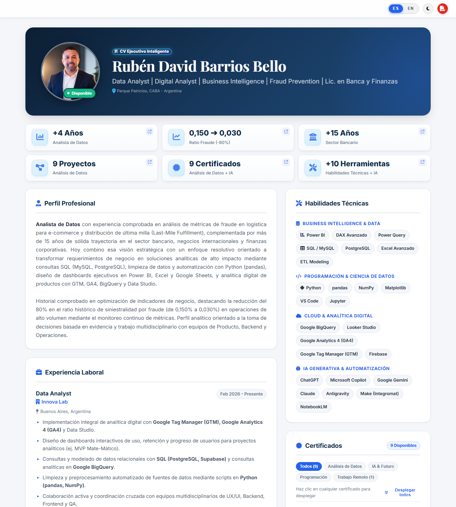
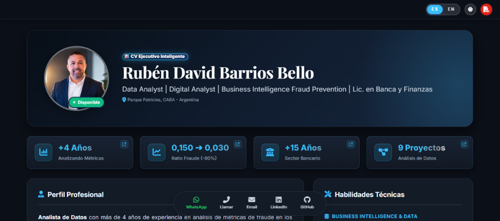
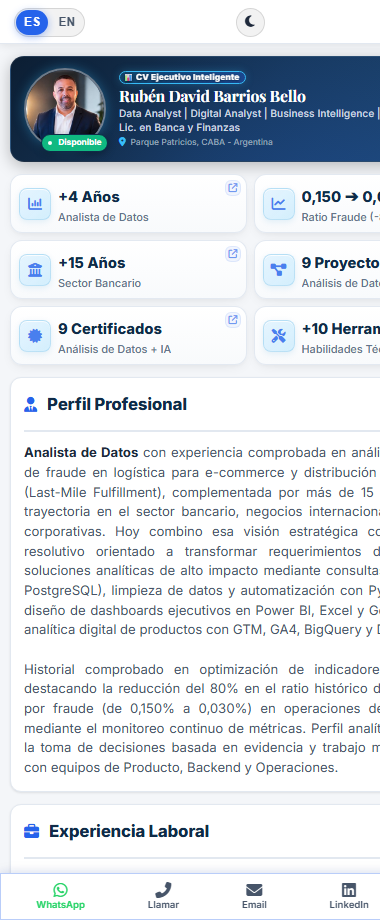
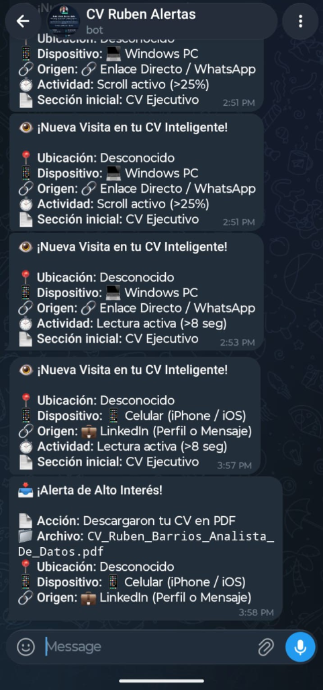
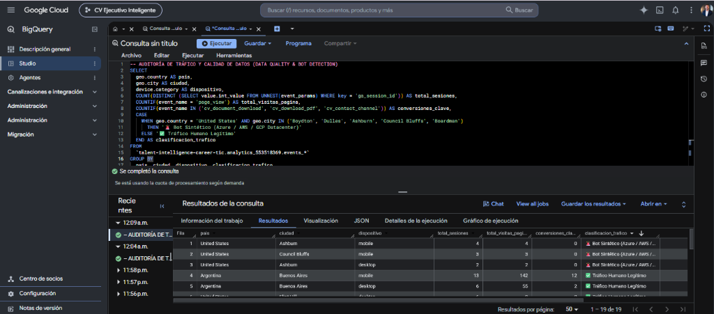
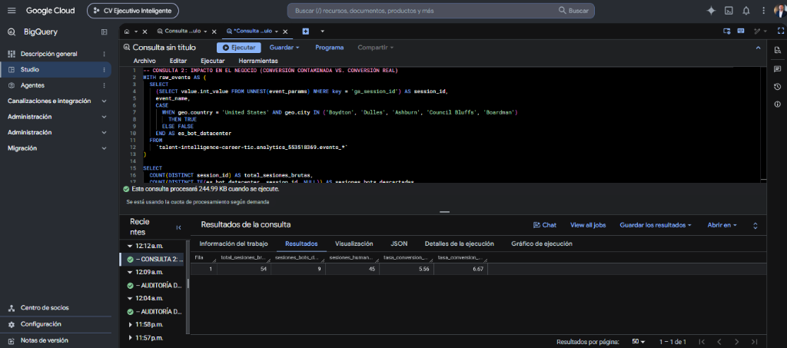
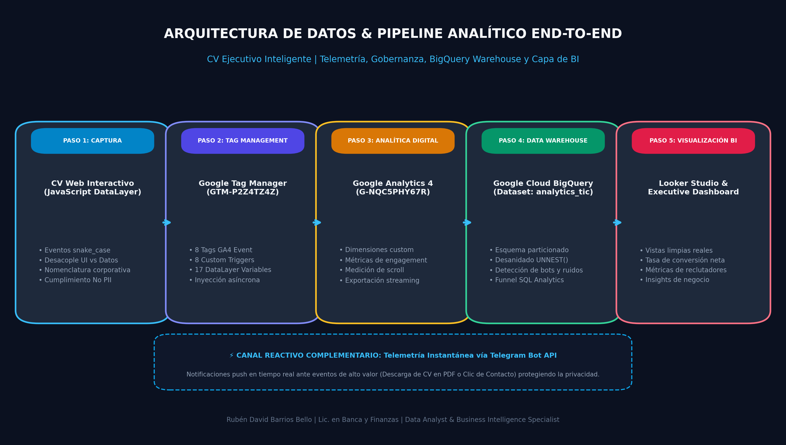
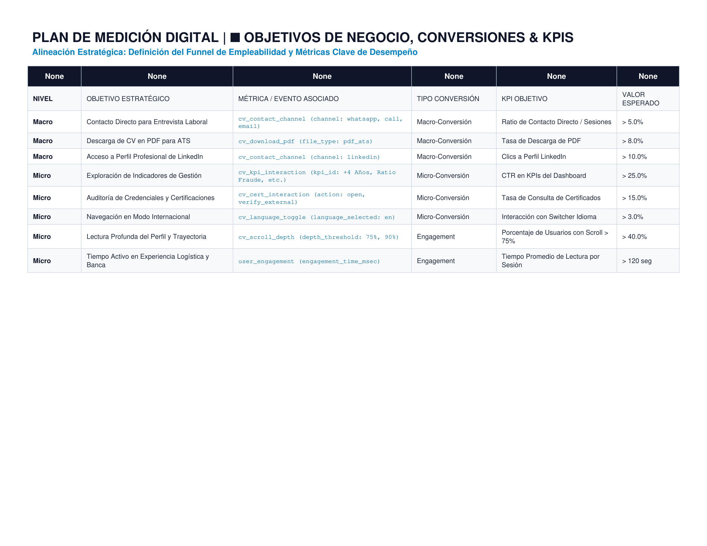
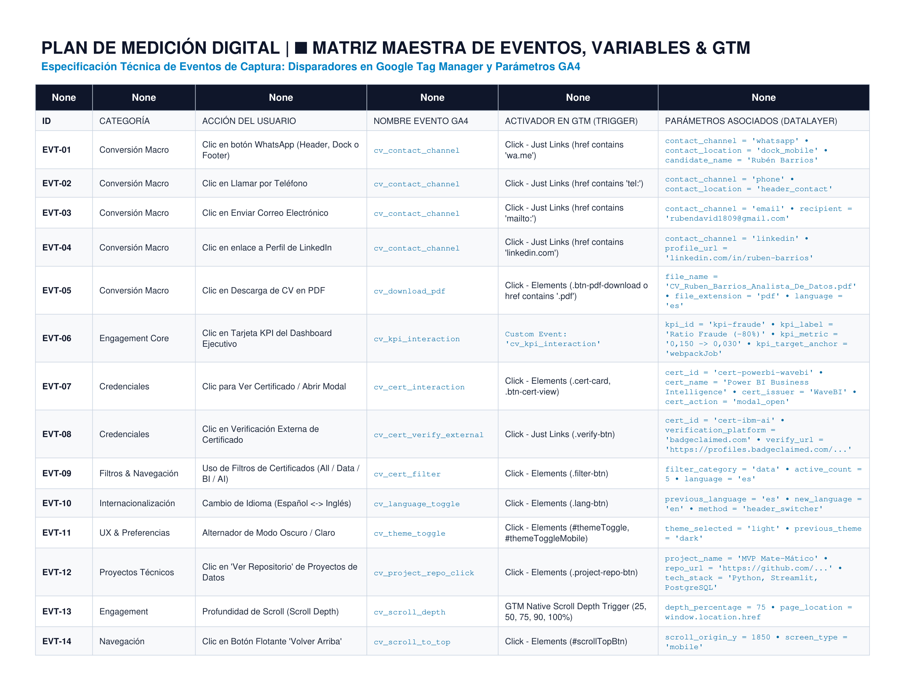
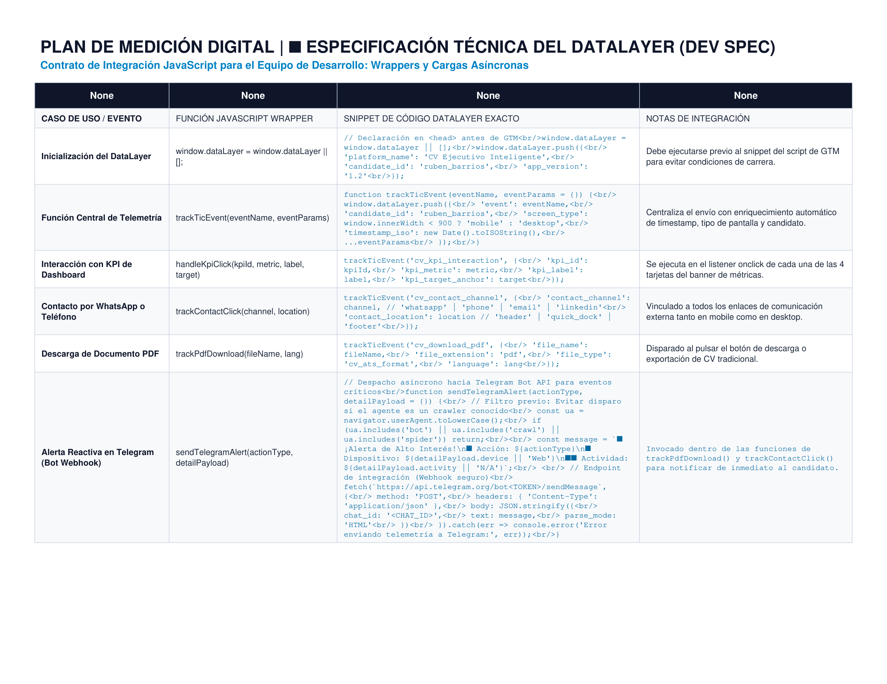

# 📊 CV Ejecutivo Inteligente — CV Interactivo: Rubén David Barrios Bello

<div align="center">

[](Plan_Estrategico_Talent_Intelligence_Career_TIC_Ruben_Barrios.pdf)
[](https://rubenbarrios-bigdata.github.io/cv-ejecutivo-inteligente/)
[](https://rubenbarrios-bigdata.github.io/cv-ejecutivo-inteligente/CV_Ruben_Barrios.html)
[](https://www.linkedin.com/in/ruben-barrios)
[](https://github.com/rubenbarrios-bigdata)
[](#-sistema-de-telemetría-en-tiempo-real--alertas-vía-telegram-bot)

<br>


-000000?style=flat-square&logo=json&logoColor=white)


<br>

### 💡 *"CV con mentalidad de dashboard — 4 KPIs clave sobre mi perfil profesional"*

**Data Analyst | Digital Analyst | Business Intelligence | Fraud Prevention | Lic. en Banca y Finanzas**

</div>

---

## 📄 Archivos del CV en HTML Incluidos en el Repositorio

El repositorio incluye el **CV completo en formato HTML nativo**, estructurado como una aplicación web moderna, interactiva, responsiva y auto-contenida:

| Formato | Archivo en el Repositorio | Enlace de Visualización Directa | Descripción |
| :--- | :--- | :--- | :--- |
| **CV Web Desktop (HTML Principal)** | [`CV_Ruben_Barrios.html`](CV_Ruben_Barrios.html) & [`index.html`](index.html) | 🌐 [Abrir CV Web en GitHub Pages](https://rubenbarrios-bigdata.github.io/cv-ejecutivo-inteligente/CV_Ruben_Barrios.html) | Experiencia interactiva completa: 4 KPIs dinámicos, navegación por anclas, alternador de Modo Oscuro/Claro y filtros de certificaciones. |
| **CV Web Mobile (HTML)** | [`CV_Ruben_Barrios_Mobile.html`](CV_Ruben_Barrios_Mobile.html) & [`mobile.html`](mobile.html) | 📱 [Abrir versión Mobile en GitHub Pages](https://rubenbarrios-bigdata.github.io/cv-ejecutivo-inteligente/CV_Ruben_Barrios_Mobile.html) | Versión adaptada con navegación vertical optimizada para pantallas táctiles de celulares. |
| **Descarga Directa del Código HTML** | [`CV_Ruben_Barrios.html`](CV_Ruben_Barrios.html) | 📥 [Descargar archivo .html](https://raw.githubusercontent.com/rubenbarrios-bigdata/cv-ejecutivo-inteligente/main/CV_Ruben_Barrios.html) | Podés descargarlo y abrirlo con doble clic en cualquier navegador (Chrome, Edge, Safari, Firefox) sin necesidad de internet ni servidores. |
| **Plan de Medición Digital (Excel)** | [Plan_de_Medicion_Digital_CV_Ejecutivo_Inteligente.xlsx](Plan_de_Medicion_Digital_CV_Ejecutivo_Inteligente.xlsx) | 📊 [Descargar Plan de Medición (.xlsx)](https://github.com/rubenbarrios-bigdata/cv-ejecutivo-inteligente/raw/main/Plan_de_Medicion_Digital_CV_Ejecutivo_Inteligente.xlsx) | Tracking Plan Enterprise: Matriz de eventos GA4/GTM, variables DataLayer, definiciones personalizadas y SQL para BigQuery. |
| **Modelos Analíticos SQL en BigQuery** | [`sql/`](sql/) & [`sql/README.md`](sql/README.md) | 🏛️ [Ver Modelos SQL](sql/README.md) | 6 modelos de datos en Google Cloud BigQuery: desanidado de eventos GA4, funnels de conversión, auditoría de bots y Data Quality. |
| **Versión en Documento PDF** | [`CV_Ruben_Barrios_Analista_De_Datos.pdf`](CV_Ruben_Barrios_Analista_De_Datos.pdf) | 📕 [Ver / Descargar PDF](https://github.com/rubenbarrios-bigdata/cv-ejecutivo-inteligente/raw/main/CV_Ruben_Barrios_Analista_De_Datos.pdf) | Documento tradicional listo para adjuntar en sistemas de selección ATS o procesos estándar. |

> 💡 **Ventaja de un CV en HTML para un Analista de Datos**:
> Presentar el currículum en formato HTML demuestra en la práctica conocimientos fundamentales en tecnologías web (DOM, CSS, JavaScript, JSON y APIs), habilidades indispensables para la implementación de analítica digital (GA4, GTM), medición de eventos y desarrollo de interfaces interactivas de Business Intelligence.

---

## 🎯 El Enfoque: "CV con Mentalidad de Dashboard"

En el análisis de datos, el valor no reside únicamente en listar responsabilidades acumuladas, sino en **comunicar métricas de impacto, ratios de eficiencia y evidencia cuantificable** desde el primer contacto visual.

Este CV fue concebido e implementado bajo los principios de diseño de un **Executive Dashboard**:
- **Consumo rápido de insights**: El reclutador o líder de datos visualiza de inmediato 4 indicadores clave que resumen más de 16 años de trayectoria profesional combinada.
- **Trazabilidad y navegación orientada a métricas**: Cada tarjeta de KPI actúa como un elemento interactivo que redirige hacia el contexto específico del proyecto o logro que respalda ese número.
- **Mentalidad analítica en el código**: Demuestra cómo un analista aborda un producto digital, aplicando estándares modernos de desacoplamiento de datos y diseño responsive.

---

## 📈 Los 4 KPIs Estratégicos

| KPI | Métrica Clave | Enfoque de Negocio & Impacto Analítico |
| :---: | :---: | :--- |
| <div align="center"></div> | **`+4 Años`**<br><sub>Analista de Datos</sub> | **Detección temprana y control de riesgos:** Análisis de métricas transaccionales, detección de anomalías y prevención de contracargos en operaciones de alto volumen para logística y comercio electrónico. |
| <div align="center"></div> | **`0,150 ➔ 0,030`**<br><sub>Ratio Fraude (-80%)</sub> | **Impacto económico directo:** Descenso del **80%** en el ratio de fraude mediante la optimización de reglas de negocio, scoring predictivo y seguimiento periódico de indicadores de riesgo. |
| <div align="center"></div> | **`+15 Años`**<br><sub>Sector Bancario</sub> | **Sólido criterio de negocio y finanzas:** Dominio operativo en Comercio Exterior, Operaciones Internacionales, conciliaciones transaccionales y normativas cambiarias bancarias. |
| <div align="center"></div> | **`9 Proyectos`**<br><sub>Análisis de Datos</sub> | **Soluciones analíticas aplicadas:** Portafolio técnico de dashboards y productos de datos en Power BI, DAX, Excel Avanzado, SQL, Python, GTM, GA4 y Data Studio. |

---

## 📸 Capturas de Pantalla del CV Renderizado

### 1. Banner Ejecutivo de KPIs y Perfil Profesional
Visualización en modo claro destacando los 4 indicadores clave y la síntesis de perfil:

<div align="center">
  
</div>

---

### 2. Vista Panorámica Desktop (Experiencia Laboral y Stack Técnico)
Distribución tipo dashboard de dos columnas con experiencia estructurada y matriz de habilidades:

<div align="center">
  
</div>

---

### 3. Modo Oscuro (Dark Theme Ejecutivo & Barra de Contacto Rápido)
Soporte completo para tema oscuro con paleta HSL optimizada para reducir fatiga visual, contrastes analíticos y dock interactivo de acceso inmediato a canales de contacto:

<div align="center">
  
</div>

---

### 4. Centro Interactivo de Certificaciones con Filtros por Categoría
Explorador interactivo con filtrado dinámico (`Data & BI`, `IA & ML`, `Programación`, `Trabajo Remoto`) y enlaces a credenciales oficiales verificadas (Credly, BadgeClaimed, OpenBadgeFactory):

<div align="center">
  
</div>

---

### 5. Experiencia Mobile Optimizada
Diseño responsivo nativo adaptado a dispositivos móviles para lectura ágil durante procesos de selección:

<div align="center">
  
</div>

---

### 6. Telemetría y Alertas Push en Vivo (Telegram Bot)
Notificaciones push reactivas en el smartphone alertando visitas calificadas, origen de tráfico y descargas de PDF:

<div align="center">
  
</div>

---

### 7. Auditoría de Calidad de Datos y Detección de Bots en Google Cloud BigQuery
Inspección heurística y filtrado analítico en BigQuery Studio clasificando sesiones de datacenters cloud (AWS/Azure/GCP) vs. tráfico humano verificado:

<div align="center">
  
  <p><em>Consulta 1: Detección y clasificación automática de crawlers/datacenters sin conversiones frente a visitas humanas con alta interacción.</em></p>
</div>

---

### 8. Análisis de Impacto en Negocio: Conversión Limpia Real vs. Contaminada
Cuantificación en BigQuery de la dilución de métricas por ruido sintético: corrección analítica de la tasa de conversión de **5.56%** (bruta) a **6.67%** (neta real humana):

<div align="center">
  
  <p><em>Consulta 2: Aislamiento de 9 sesiones no humanas (16.7% bots) demostrando el impacto positivo de Data Quality (+1.11 pp de conversión neta).</em></p>
</div>

---

### 9. Arquitectura de Datos & Pipeline Analítico End-to-End
Diagrama ejecutivo del flujo de datos continuo desde la captura en cliente hasta la visualización en Business Intelligence:

<div align="center">
  
  <p><em>Flujo de 5 fases: Client DataLayer ➔ Google Tag Manager ➔ GA4 ➔ Google Cloud BigQuery ➔ Looker Studio (+ Telemetría reactiva vía Telegram Bot).</em></p>
</div>

---

### 10. Plan de Medición Digital: Objetivos Estratégicos, Conversiones & KPIs
Alineación del embudo de contratación y gobernanza de indicadores clave (Macro, Micro y Engagement):

<div align="center">
  
  <p><em>Hoja 2 del Tracking Plan Excel: Definición de metas para descargas ATS, contacto directo y ratios de lectura.</em></p>
</div>

---

### 11. Plan de Medición Digital: Matriz Maestra de Eventos GA4 & GTM
Especificación técnica de nombres de eventos, activadores (triggers) y variables del DataLayer:

<div align="center">
  
  <p><em>Hoja 3 del Tracking Plan Excel: 15 eventos normalizados bajo nomenclatura snake_case estricta y cumplimiento No PII.</em></p>
</div>

---

### 12. Plan de Medición Digital: Especificación Técnica de DataLayer (Dev Spec)
Contrato técnico para desarrollo frontend con funciones JavaScript wrappers y envío asíncrono no bloqueante:

<div align="center">
  
  <p><em>Hoja 5 del Tracking Plan Excel: Snippets de integración y mejores prácticas de inyección antes de GTM.</em></p>
</div>

---

## 🏗️ Arquitectura Técnica: Separación de Capas (Data Layer vs. Presentation)

Como prueba del criterio analítico y de ingeniería de software, los datos del dashboard no están rígidamente acoplados al documento HTML. Se implementó una **arquitectura desacoplada**:

```
├── data.json                   <-- [CAPA DE DATOS] Fuente única de verdad (KPIs y metadata)
├── CV_Ruben_Barrios.html       <-- [CV EN HTML] Documento web principal con diseño dashboard
├── index.html                  <-- [PÁGINA RAÍZ] Entry point de GitHub Pages
├── CV_Ruben_Barrios_Mobile.html<-- [CV HTML MOBILE] Versión adaptada a smartphones
├── mobile.html                 <-- Alias para versión móvil
├── sql/                        <-- [MOTOR ANALÍTICO] 6 Modelos SQL y Vistas BigQuery
│   ├── 01_vw_kpi_interactions.sql
│   ├── 02_vw_recruiter_engagement_funnel.sql
│   ├── 03_vw_executive_summary.sql
│   ├── 04_vw_looker_studio_clean_funnel.sql
│   ├── 05_vw_verify_telegram_telemetry.sql
│   ├── 06_audit_bots_and_data_quality.sql
│   └── README.md
├── certs_images/               <-- Assets gráficos de credenciales y certificaciones
└── screenshots/                <-- Capturas del render visual, alertas y BigQuery Studio
```

### ¿Cómo funciona la carga dinámica?
1. **Fuente de Datos Centralizada (`data.json`)**:
   Las métricas, descripciones, tooltips e iconos se administran en un esquema JSON estructurado. Modificar un KPI no requiere editar la plantilla HTML.
2. **Consumo Asíncrono (`fetch API`)**:
   Al inicializarse la página en GitHub Pages, una función asíncrona (`async/await`) consume `data.json` e inyecta dinámicamente las tarjetas de indicadores en el contenedor `#statsBanner`.
3. **Resiliencia con Fallback Progresivo**:
   Si el archivo se abre localmente por doble clic (`file:///`) en un entorno donde las políticas de seguridad CORS del navegador restringen peticiones locales, el sistema activa automáticamente un fallback pre-renderizado, garantizando que el usuario jamás vea un estado en blanco o roto.

---

## 🔗 Despliegue en GitHub Pages & LinkedIn

### 🌐 Acceso al CV en Vivo:
El CV interactivo se encuentra publicado y operativo a través de **GitHub Pages**:
- **Versión Principal**: [https://rubenbarrios-bigdata.github.io/cv-ejecutivo-inteligente/](https://rubenbarrios-bigdata.github.io/cv-ejecutivo-inteligente/)
- **Enlace directo al HTML**: [https://rubenbarrios-bigdata.github.io/cv-ejecutivo-inteligente/CV_Ruben_Barrios.html](https://rubenbarrios-bigdata.github.io/cv-ejecutivo-inteligente/CV_Ruben_Barrios.html)

### 💼 Cómo destacar este proyecto en LinkedIn:

Para maximizar la visibilidad ante reclutadores técnicos y hiring managers en LinkedIn:

1. **Sección "Destacados" (Featured) del Perfil de LinkedIn**:
   - En tu perfil de LinkedIn, hacé clic en **Añadir sección** ➔ **Destacados** ➔ **+ Enlaces**.
   - Pegá la URL: `https://rubenbarrios-bigdata.github.io/cv-ejecutivo-inteligente/`
   - **Título**: `📊 CV Interactivo — Dashboard de Métricas Profesionales & Data Analytics`
   - **Descripción**: `Mi CV interactivo estructurado como un dashboard ejecutivo con 4 KPIs clave sobre mi trayectoria en prevención de fraudes, finanzas bancarias y analítica de datos.`
   - Podés adjuntar como miniatura la captura `screenshots/01_kpis_dashboard_header.png`.

2. **Enlace de Contacto / Encabezado de Perfil**:
   - Editá tu información de contacto en LinkedIn.
   - En el campo **Sitio Web**, seleccioná tipo *"Portafolio"* o *"Personal"* e ingresá el link de GitHub Pages.

3. **Publicación en el Feed de LinkedIn (Post de Alto Impacto)**:
   - Compartí una breve reflexión sobre por qué los analistas de datos deberían estructurar su experiencia orientada a KPIs y métricas cuantificables, adjuntando la captura en modo oscuro y el enlace a la versión interactiva.

---

## 🤖 Sistema de Telemetría en Tiempo Real & Alertas vía Telegram Bot

A diferencia de un currículum estático convencional, este proyecto incorpora una capa de **observabilidad y notificaciones push en tiempo real** (`CV_TG_NOTIFIER`) orientada a alertar inmediatamente al autor cuando un reclutador interactúa con su perfil profesional:

```
[ Visitante / Reclutador ]
         │
         ▼
[ CV Ejecutivo Inteligente (GitHub Pages) ]
         │
    ┌────┴───────────────────────────────┐
    ▼                                    ▼
[ Telemetry Engine ]              [ IP Geolocation API ]
(Tiempo > 8s, Scroll > 25%,        (Ciudad, País, Red)
 Clic en PDF, WhatsApp, LinkedIn)        │
    │                                    │
    └──────────────────┬─────────────────┘
                       ▼
         [ Telegram Bot API (HTTPS/CORS) ]
                       ▼
       [ 📱 Alerta Push en el Celular de Rubén ]
```

### 🔔 Tipos de Eventos Monitoreados:

1. **👁️ Visita Calificada (Filtro Anti-Rebote & Anti-Crawler)**:
   - Se evita el spam generado por rebotes accidentales o indexadores automáticos.
   - La alerta se dispara únicamente si el visitante permanece **más de 8 segundos** o realiza un **scroll activo (>25%)** por la experiencia profesional.
   - Notifica: **Ubicación aproximada** (Ciudad y País vía API abierta), **Dispositivo** (iOS, Android, Windows, Mac), **Fuente de Referencia** (`document.referrer`: LinkedIn, WhatsApp, Google) y página de aterrizaje.
2. **📥 Descarga del CV en PDF (Señal de Alto Interés)**:
   - Notificación de máxima prioridad cuando un reclutador pulsa **"Descargar CV en PDF"**, detallando el archivo descargado para preparar un seguimiento ágil.
3. **💬 Clics en Canales de Contacto Directo**:
   - Notifica en tiempo real si el usuario presiona los botones de **WhatsApp**, **LinkedIn** o **Email**.
4. **🛡️ Filtro de Auto-Visitas (Modo Dueño)**:
   - Admite el parámetro URL `?me=1` para registrar el flag `cv_owner_mode: true` en el almacenamiento local del autor, silenciando automáticamente sus propias sesiones de prueba y edición.

### 📱 Evidencia en Vivo: Alertas Push Recibidas en Telegram

Captura real de las notificaciones push despachadas instantáneamente al móvil por el bot **`CV Ruben Alertas`** al registrar visitas calificadas (por tiempo o scroll), origen del visitante (LinkedIn, WhatsApp) y descargas del CV en PDF:

<div align="center">
  
  <p><em>Notificaciones operativas en tiempo real: detección de dispositivo, origen del tráfico y acciones de alta prioridad.</em></p>
</div>

---

## 🛠️ Tecnologías Utilizadas

- **Frontend Core**: HTML5 Semántico, CSS3 Moderno (Variables CSS / Tokens de Diseño, Glassmorphism, CSS Grid & Flexbox).
- **Lógica & Reactividad**: JavaScript Vanilla (ES6+) con `fetch API`, `async/await`, y persistencia de temas mediante `localStorage`.
- **Telemetría & Eventos en Tiempo Real**: Motor de observabilidad client-side integrado con Telegram Bot API, geolocalización IP mediante API abierta (`freeipapi`) y capa DataLayer estándar compatible con Google Tag Manager (GTM) y Google Analytics 4 (GA4).
- **Capa de Datos**: JSON estructurado (`data.json`) desacoplado de la UI.
- **Tipografía & Estética**: Google Fonts (*Inter*, *Playfair Display*), FontAwesome 6.
- **Exportabilidad**: Hojas de estilo `@media print` optimizadas para generar PDF limpio sin cortes indeseados.

---

## 💻 Visualización y Ejecución Local

Podés abrir y ejecutar este proyecto de tres formas sencillas:

### Opción 1: Abrir directamente el archivo HTML (Sin instalar nada)
Simplemente hacé doble clic en el archivo [`CV_Ruben_Barrios.html`](CV_Ruben_Barrios.html) o [`index.html`](index.html). Se abrirá automáticamente en tu navegador predeterminado (Chrome, Edge, Firefox, etc.).

### Opción 2: Clonar y servir con servidor local
```bash
# 1. Clonar el repositorio
git clone https://github.com/rubenbarrios-bigdata/cv-ejecutivo-inteligente.git

# 2. Ingresar a la carpeta
cd cv-ejecutivo-inteligente

# 3. Iniciar un servidor local (con Python)
python -m http.server 8000
```
Luego abrí tu navegador en: `http://localhost:8000`

---

## 🛡️ Propiedad Intelectual, Autoría & Registro de Obra

### 📌 Declaración Oficial de Autoría y Creación
**CV Ejecutivo Inteligente** es una plataforma tecnológica e interactiva de visualización curricular y métricas profesionales concebida con mentalidad de *executive dashboard*, desacoplamiento estricto de capa de datos (`data.json`), diseño responsivo nativo y analítica digital integrada.

- **Obra / Plataforma**: **CV Ejecutivo Inteligente**
- **Autor, Diseñador y Desarrollador**: **Rubén David Barrios Bello**
- **Perfil Biográfico del Autor**: Profesional de **origen venezolano**, radicado y con actividad profesional en **Buenos Aires, Argentina desde el año 2018**. Licenciado en Banca y Finanzas con más de 16 años de trayectoria profesional combinada en el sector bancario (comercio exterior, conciliaciones, regulaciones cambiarias) y analítica avanzada (Data Analyst, Business Intelligence, prevención de fraudes y reducción de contracargos en e-commerce).
- **Lugar y Fecha de Creación**: Buenos Aires, Argentina — 2026.
- **Carácter de la Obra**: Software / Aplicación Web Interactiva de Inteligencia Curricular (CV Interactivo y Dashboard de KPIs desacoplado).

### ⚖️ Marco Legal y Protección de Derechos
1. **Derechos de Autor (Ley 11.723 - República Argentina)**:
   La estructura, diseño visual, código fuente (HTML5, CSS3, JavaScript ES6+), esquema de datos (`data.json`) y el concepto funcional **CV Ejecutivo Inteligente** constituyen una obra técnica e intelectual original protegida bajo la Ley de Propiedad Intelectual N° 11.723 de la República Argentina y convenios internacionales (Convenio de Berna).
2. **Depósito y Registro Oficial**:
   Obra técnica y software en proceso de registro formal ante la **Dirección Nacional del Derecho de Autor (DNDA)** del Ministerio de Justicia de la República Argentina a través de la plataforma oficial de Trámites a Distancia (**TAD**). La guía paso a paso se detalla en [`GUIA_PASO_A_PASO_TRAMITE_TAD_DNDA.md`](GUIA_PASO_A_PASO_TRAMITE_TAD_DNDA.md).
3. **Documentación Estratégica**:
   El dossier metodológico completo, arquitectura técnica y hoja de ruta evolutiva se encuentran documentados en el informe maestro: [`Plan_Estrategico_CV_Ejecutivo_Inteligente_Ruben_Barrios.pdf`](Plan_Estrategico_CV_Ejecutivo_Inteligente_Ruben_Barrios.pdf).

---

## 📩 Contacto

- **Nombre**: Rubén David Barrios Bello
- **Ubicación**: Parque Patricios, CABA — Argentina
- **Teléfono**: [+54 9 11 7025-9429](tel:+5491170259429)
- **Email**: [rubendavid1809@gmail.com](mailto:rubendavid1809@gmail.com)
- **LinkedIn**: [linkedin.com/in/ruben-barrios](https://www.linkedin.com/in/ruben-barrios)
- **GitHub**: [github.com/rubenbarrios-bigdata](https://github.com/rubenbarrios-bigdata)
