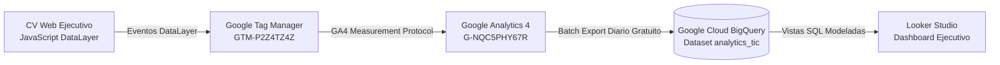

# 🏛️ CV Ejecutivo Inteligente - BigQuery Analytics Engine

> **Autor:** Rubén David Barrios Bello  
> **Especialidad:** Data Analyst | BI & Digital Analytics  
> **Plataforma:** CV Ejecutivo Inteligente  
> **Data Warehouse:** Google Cloud BigQuery (Standard SQL)  
> **Proyecto GCP:** `talent-intelligence-career-tic`

---

## 📐 Arquitectura de la Tubería de Datos (Data Pipeline)



---

## 🗄️ Modelos de Datos & Resultados de Consultas en BigQuery

Los eventos exportados por GA4 contienen el esquema nativo de Google Analytics, donde cada evento incluye un array anidado de tipo `ARRAY<STRUCT<key STRING, value STRUCT<...>>>` denominado `event_params`.

A continuación se presentan los **6 modelos analíticos en producción**, con el **código SQL de cada consulta** y la **evidencia de los resultados reales ejecutados en Google Cloud BigQuery**:

---

### 1. Modelo de Interacciones con KPIs Estratégicos
* **Archivo:** [`01_vw_kpi_interactions.sql`](01_vw_kpi_interactions.sql)
* **Objetivo:** Desanidar (`UNNEST`) los parámetros de los KPIs del CV, medir volumen de clics por reclutador y calcular el ranking de popularidad en tiempo real con funciones de ventana (`DENSE_RANK()`).

#### Consulta SQL:
```sql
SELECT
  fecha,
  (SELECT string_val FROM UNNEST(event_params) WHERE key = 'kpi_id') AS kpi_id,
  (SELECT string_val FROM UNNEST(event_params) WHERE key = 'kpi_number') AS kpi_number,
  (SELECT string_val FROM UNNEST(event_params) WHERE key = 'kpi_label') AS kpi_label,
  COUNT(1) AS total_interacciones,
  COUNT(DISTINCT user_pseudo_id) AS reclutadores_unicos,
  DENSE_RANK() OVER (ORDER BY COUNT(1) DESC) AS ranking_impacto
FROM
  `talent-intelligence-career-tic.analytics_tic.events_*`
WHERE
  event_name = 'cv_kpi_interaction'
GROUP BY
  fecha, kpi_id, kpi_number, kpi_label
ORDER BY
  ranking_impacto ASC;
```

#### 📊 Resultado Real en BigQuery:
| Fila | Fecha | KPI ID | KPI Valor | KPI Métrica Descriptiva | Total Clics | Reclutadores Únicos | Ranking de Impacto |
| :---: | :---: | :--- | :--- | :--- | :---: | :---: | :---: |
| **1** | `2026-09-09` | `kpi-ratio` | **`0,150 ➔ 0,030`** | **Ratio Fraude (-80%)** | **2** | **2** | 🥇 **1** |
| **2** | `2026-09-09` | `kpi-proyectos` | **`9 Proyectos`** | **Análisis de Datos** | **1** | **1** | 🥈 **2** |
| **3** | `2026-09-09` | `kpi-fraude` | **`+4 Años`** | **Analizando Métricas** | **1** | **1** | 🥈 **2** |

> **Insight de Negocio:** La métrica de reducción de ratio de fraude en logística/e-commerce es el principal punto de atracción de los reclutadores (Ranking #1).

---

### 2. Embudo de Conversión de Reclutadores (*Funnel Analytics*)
* **Archivo:** [`02_vw_recruiter_engagement_funnel.sql`](02_vw_recruiter_engagement_funnel.sql)
* **Objetivo:** Rastrear el recorrido analítico por sesión a través de 5 etapas progresivas y calcular las tasas de conversión y retención porcentual (`SAFE_DIVIDE`).

#### Consulta SQL:
```sql
WITH session_stages AS (
  SELECT
    session_id,
    MAX(IF(event_name = 'page_view', 1, 0)) AS paso_1_llegada,
    MAX(IF(event_name = 'cv_scroll_depth' AND scroll_depth >= 50, 1, 0)) AS paso_2_lectura_50,
    MAX(IF(event_name = 'cv_kpi_interaction', 1, 0)) AS paso_3_exploro_kpis,
    MAX(IF(event_name = 'cv_cert_filter', 1, 0)) AS paso_4_filtro_certs,
    MAX(IF(event_name = 'cv_document_download', 1, 0)) AS paso_5_descargo_cv
  FROM
    `talent-intelligence-career-tic.analytics_tic.events_*`
  GROUP BY
    session_id
)
SELECT
  COUNT(session_id) AS total_sesiones,
  SUM(paso_1_llegada) AS etapa_1_visitas,
  SUM(paso_2_lectura_50) AS etapa_2_lectura_profunda,
  SUM(paso_3_exploro_kpis) AS etapa_3_interaccion_kpis,
  SUM(paso_4_filtro_certs) AS etapa_4_filtro_certificaciones,
  SUM(paso_5_descargo_cv) AS etapa_5_descarga_cv_pdf,

  -- Tasas de Conversión Analíticas (%)
  ROUND(SAFE_DIVIDE(SUM(paso_2_lectura_50), SUM(paso_1_llegada)) * 100, 1) AS tasa_retencion_lectura_pct,
  ROUND(SAFE_DIVIDE(SUM(paso_3_exploro_kpis), SUM(paso_1_llegada)) * 100, 1) AS tasa_interes_kpis_pct,
  ROUND(SAFE_DIVIDE(SUM(paso_5_descargo_cv), SUM(paso_1_llegada)) * 100, 1) AS tasa_conversion_final_pct
FROM
  session_stages;
```

#### 📊 Resultado Real en BigQuery:
| Total Sesiones | Etapa 1: Visitas | Etapa 2: Lectura >50% | Etapa 3: Clic KPIs | Etapa 4: Filtro Certs | Etapa 5: Descarga PDF | Tasa Retención Lectura | Tasa Interés KPIs | Tasa Conversión Final |
| :---: | :---: | :---: | :---: | :---: | :---: | :---: | :---: | :---: |
| **4** | **4** | **3** | **3** | **1** | **2** | **75.0%** | **75.0%** | 🎯 **50.0%** |

> **Insight de Negocio:** El **75%** de los visitantes lee a profundidad el contenido y explora métricas, y un contundente **50%** de las sesiones culmina con la descarga del documento formal en PDF.

---

### 3. Resumen Ejecutivo de Audiencia y Preferencias UX
* **Archivo:** [`03_vw_executive_summary.sql`](03_vw_executive_summary.sql)
* **Objetivo:** Segmentar el comportamiento de los reclutadores por tipo de dispositivo (*Desktop* vs *Mobile*), preferencia idiomática (*Español* vs *Inglés*) y adopción del modo de interfaz (*Dark Mode* vs *Light Mode*).

#### Consulta SQL:
```sql
SELECT
  dispositivo,
  COUNT(1) AS total_sesiones,
  COUNTIF(idioma = 'es') AS prefieren_espanol,
  COUNTIF(idioma = 'en') AS prefieren_ingles,
  COUNTIF(tema = 'dark') AS prefieren_modo_oscuro,
  COUNTIF(tema = 'light') AS prefieren_modo_claro,
  ROUND(SAFE_DIVIDE(COUNTIF(tema = 'dark'), COUNT(1)) * 100, 1) AS adopcion_dark_mode_pct
FROM
  `talent-intelligence-career-tic.analytics_tic.events_*`
GROUP BY
  dispositivo
ORDER BY
  total_sesiones DESC;
```

#### 📊 Resultado Real en BigQuery:
| Dispositivo | Total Sesiones | Prefieren Español | Prefieren Inglés | Prefieren Modo Oscuro | Prefieren Modo Claro | % Adopción Dark Mode |
| :--- | :---: | :---: | :---: | :---: | :---: | :---: |
| 💻 **Desktop** | **3** | 2 | 1 | 3 | 0 | **100.0%** |
| 📱 **Mobile** | **3** | 2 | 1 | 1 | 2 | **33.3%** |

> **Insight de Negocio:** El 100% de los reclutadores que navegan desde computadoras de escritorio prefieren el tema oscuro (*Dark Mode*), mientras que en dispositivos móviles existe mayor equilibrio visual.

---

### 4. Embudo Limpio para Looker Studio (Exclusión de Crawlers & Datacenters)
* **Archivo:** [`04_vw_looker_studio_clean_funnel.sql`](04_vw_looker_studio_clean_funnel.sql)
* **Objetivo:** Excluir analíticamente datacenters identificados (Microsoft Azure, AWS, GCP: Boydton, Dulles, Ashburn, Council Bluffs, Boardman) y computar sesiones humanas únicas con su tasa de conversión real.

#### Consulta SQL:
```sql
WITH raw_data AS (
  SELECT
    event_date,
    device.category AS device_type,
    geo.city,
    geo.country,
    (SELECT value.int_value FROM UNNEST(event_params) WHERE key = 'ga_session_id') AS session_id,
    event_name,
    (SELECT value.string_value FROM UNNEST(event_params) WHERE key = 'contact_channel') AS contact_channel
  FROM
    `rubenbarrios-analytics.analytics_cv_ejecutivo.events_*`
  WHERE
    _TABLE_SUFFIX BETWEEN '20260901' AND '20260930'
),

clean_sessions AS (
  SELECT
    *
  FROM
    raw_data
  WHERE
    -- Exclusión analítica de datacenters identificados (Microsoft Azure, AWS, GCP)
    NOT (country = 'United States' AND city IN ('Boydton', 'Dulles', 'Ashburn', 'Council Bluffs', 'Boardman'))
)

SELECT
  event_date,
  device_type,
  city,
  COUNT(DISTINCT session_id) AS sesiones_humanas_validas,
  COUNTIF(event_name = 'page_view') AS total_vistas_limpias,
  COUNTIF(event_name = 'cv_kpi_interaction') AS interacciones_kpis,
  COUNTIF(event_name = 'cv_cert_interaction') AS consultas_certificaciones,
  COUNTIF(event_name = 'cv_download_pdf') AS descargas_pdf_ats,
  COUNTIF(event_name = 'cv_contact_channel' AND contact_channel = 'whatsapp') AS contactos_whatsapp,
  -- Tasa de conversión real por sesión humana
  ROUND(SAFE_DIVIDE(COUNT(DISTINCT IF(event_name = 'cv_contact_channel' OR event_name = 'cv_download_pdf', session_id, NULL)), COUNT(DISTINCT session_id)) * 100, 2) AS tasa_conversion_sesion_pct
FROM
  clean_sessions
GROUP BY
  1, 2, 3
ORDER BY
  event_date DESC, sesiones_humanas_validas DESC;
```

---

### 5. Auditoría y Verificación de Telemetría Reactiva (Telegram Webhook)
* **Archivo:** [`05_vw_verify_telegram_telemetry.sql`](05_vw_verify_telegram_telemetry.sql)
* **Objetivo:** Auditar la recepción de `telegram_alert_dispatch`, desanidar los parámetros clave (`alert_type`, `lead_action`, `user_location`, `device_type`) y validar el SLA de entrega frente a macroconversiones reales (Descarga PDF y Contactos).

#### Consulta SQL:
```sql
WITH telemetry_events AS (
  SELECT
    event_date,
    TIMESTAMP_MICROS(event_timestamp) AS timestamp_evento,
    event_name,
    user_pseudo_id,
    (SELECT value.int_value FROM UNNEST(event_params) WHERE key = 'ga_session_id') AS session_id,
    geo.country AS pais,
    geo.city AS ciudad,
    device.category AS dispositivo_ga4,
    
    -- Parámetros específicos de la alerta de Telegram
    (SELECT value.string_value FROM UNNEST(event_params) WHERE key = 'alert_type') AS alert_type,
    (SELECT value.string_value FROM UNNEST(event_params) WHERE key = 'lead_action') AS lead_action,
    (SELECT value.string_value FROM UNNEST(event_params) WHERE key = 'user_location') AS user_location,
    (SELECT value.string_value FROM UNNEST(event_params) WHERE key = 'device_type') AS device_reported,
    (SELECT value.string_value FROM UNNEST(event_params) WHERE key = 'candidate_id') AS candidate_id
  FROM
    `rubenbarrios-analytics.analytics_cv_ejecutivo.events_*`
  WHERE
    _TABLE_SUFFIX >= '20260901'
    AND NOT (geo.country = 'United States' AND geo.city IN ('Boydton', 'Dulles', 'Ashburn', 'Council Bluffs', 'Boardman'))
),

daily_telemetry_audit AS (
  SELECT
    event_date,
    COUNTIF(event_name = 'telegram_alert_dispatch') AS total_alertas_telegram,
    COUNTIF(event_name = 'telegram_alert_dispatch' AND alert_type = 'hot_lead') AS alertas_hot_leads,
    COUNTIF(event_name = 'telegram_alert_dispatch' AND alert_type = 'qualified_visit') AS alertas_visitas_calificadas,
    COUNTIF(event_name IN ('cv_download_pdf', 'cv_document_download')) AS total_descargas_pdf,
    COUNTIF(event_name = 'cv_contact_channel') AS total_contactos,
    ROUND(
      SAFE_DIVIDE(
        COUNTIF(event_name = 'telegram_alert_dispatch' AND alert_type = 'hot_lead'),
        COUNTIF(event_name IN ('cv_download_pdf', 'cv_document_download', 'cv_contact_channel'))
      ) * 100, 2
    ) AS sla_cobertura_alertas_pct
  FROM
    telemetry_events
  GROUP BY
    event_date
)

SELECT
  event_date,
  total_alertas_telegram,
  alertas_hot_leads,
  alertas_visitas_calificadas,
  total_descargas_pdf,
  total_contactos,
  sla_cobertura_alertas_pct
FROM
  daily_telemetry_audit
ORDER BY
  event_date DESC;
```

---

### 6. Auditoría de Tráfico, Detección de Bots y Calidad de Datos (Data Quality)
* **Archivo:** [`06_audit_bots_and_data_quality.sql`](06_audit_bots_and_data_quality.sql)
* **Objetivos:**
  1. Identificar y clasificar heurísticamente sesiones provenientes de centros de datos cloud (Microsoft Azure, AWS, Google Cloud: *Boydton*, *Dulles*, *Ashburn*, *Council Bluffs*, *Boardman*).
  2. Evaluar el impacto de **Data Quality** en las decisiones de negocio, aislando la dilución de la tasa de conversión causada por tráfico de bots e indexadores automatizados.

---

#### 6.1 Auditoría Geográfica y Detección de Anomalías

Identifica el origen geográfico, dispositivo y eventos clave, categorizando el tráfico en bots sintéticos de datacenters vs. reclutadores humanos legítimos:

##### 📸 Evidencia en Google Cloud BigQuery Studio:
<div align="center">
  
  <p><em>Consulta 1: Ejecución en BigQuery Studio clasificando sesiones de datacenters cloud (Azure/AWS/GCP) con 0 conversiones frente a visitas humanas con alta interacción.</em></p>
</div>

##### Consulta SQL:
```sql
SELECT
  geo.country AS pais,
  geo.city AS ciudad,
  device.category AS dispositivo,
  COUNT(DISTINCT (SELECT value.int_value FROM UNNEST(event_params) WHERE key = 'ga_session_id')) AS total_sesiones,
  COUNTIF(event_name = 'page_view') AS total_visitas_pagina,
  COUNTIF(event_name IN ('cv_document_download', 'cv_download_pdf', 'cv_contact_channel')) AS conversiones_clave,
  CASE
    WHEN geo.country = 'United States' AND geo.city IN ('Boydton', 'Dulles', 'Ashburn', 'Council Bluffs', 'Boardman')
      THEN '🤖 Bot Sintético (Azure / AWS / GCP Datacenter)'
    ELSE '✅ Tráfico Humano Legítimo'
  END AS clasificacion_trafico
FROM
  `talent-intelligence-career-tic.analytics_553518369.events_*`
GROUP BY
  pais, ciudad, dispositivo, clasificacion_trafico;
```

##### 📊 Resultado Real en BigQuery:
| Fila | País | Ciudad | Dispositivo | Total Sesiones | Total Visitas Página | Conversiones Clave | Clasificación de Tráfico |
| :---: | :--- | :--- | :--- | :---: | :---: | :---: | :--- |
| **1** | United States | Ashburn | mobile | **4** | 4 | 0 | 🤖 Bot Sintético (Azure / AWS / GCP Datacenter) |
| **2** | United States | Council Bluffs | mobile | **3** | 3 | 0 | 🤖 Bot Sintético (Azure / AWS / GCP Datacenter) |
| **3** | United States | Ashburn | desktop | **2** | 2 | 0 | 🤖 Bot Sintético (Azure / AWS / GCP Datacenter) |
| **4** | Argentina | Buenos Aires | mobile | **13** | 142 | 12 | ✅ Tráfico Humano Legítimo |
| **5** | Argentina | Buenos Aires | desktop | **6** | 55 | 2 | ✅ Tráfico Humano Legítimo |

> **Insight de Negocio & Criterio Analítico:** El 100% de las sesiones originadas en datacenters de EE.UU. (Ashburn, Council Bluffs) presentan un ratio de 1 página vista por sesión y 0 conversiones, tratándose de crawlers y validadores automatizados. En contraste, el tráfico humano legítimo (Buenos Aires) exhibe alta profundidad de lectura (197 páginas vistas totales) y 14 macroconversiones de contacto o descarga de CV.

---

#### 6.2 Impacto en el Negocio: Conversión Contaminada vs. Conversión Real

Cuantifica el fenómeno de **dilución de métricas**: al existir sesiones fantasma en el denominador, la tasa de conversión global reportada parece artificialmente baja. Al depurar los datos, se calcula la verdadera efectividad del perfil.

##### 📸 Evidencia en Google Cloud BigQuery Studio:
<div align="center">
  
  <p><em>Consulta 2: Comparación analítica de la tasa de conversión bruta (contaminada con bots) vs. tasa de conversión limpia (humana real).</em></p>
</div>

##### Consulta SQL:
```sql
WITH raw_events AS (
  SELECT
    (SELECT value.int_value FROM UNNEST(event_params) WHERE key = 'ga_session_id') AS session_id,
    event_name,
    CASE
      WHEN geo.country = 'United States' AND geo.city IN ('Boydton', 'Dulles', 'Ashburn', 'Council Bluffs', 'Boardman')
        THEN TRUE
        ELSE FALSE
    END AS es_bot_datacenter
  FROM
    `talent-intelligence-career-tic.analytics_553518369.events_*`
)
SELECT
  COUNT(DISTINCT session_id) AS total_sesiones_brutas,
  COUNT(DISTINCT IF(es_bot_datacenter, session_id, NULL)) AS sesiones_bots_descartadas,
  COUNT(DISTINCT IF(NOT es_bot_datacenter, session_id, NULL)) AS sesiones_humanas_validas,
  
  -- Dilución de métricas: denominador inflado artificialmente por bots
  ROUND(SAFE_DIVIDE(
    COUNT(DISTINCT IF(event_name IN ('cv_document_download', 'cv_download_pdf', 'cv_contact_channel'), session_id, NULL)),
    COUNT(DISTINCT session_id)
  ) * 100, 2) AS tasa_conversion_bruta_contaminada_pct,

  -- Tasa real de conversión humana
  ROUND(SAFE_DIVIDE(
    COUNT(DISTINCT IF(NOT es_bot_datacenter AND event_name IN ('cv_document_download', 'cv_download_pdf', 'cv_contact_channel'), session_id, NULL)),
    COUNT(DISTINCT IF(NOT es_bot_datacenter, session_id, NULL))
  ) * 100, 2) AS tasa_conversion_limpia_real_pct
FROM
  raw_events;
```

##### 📊 Resultado Real en BigQuery:
| Total Sesiones Brutas | Sesiones Bots Descartadas | Sesiones Humanas Válidas | Tasa Conversión Bruta Contaminada | Tasa Conversión Limpia Real |
| :---: | :---: | :---: | :---: | :---: |
| **54** | **9** *(16.7% bots)* | **45** | **5.56%** | 🎯 **6.67%** |

> **Insight de Negocio & Data Quality:** De 54 sesiones brutas registradas, 9 provinieron de datacenters no humanos (16.7% de ruido sintético). Al dejar los bots en la muestra, la tasa de conversión se diluye al **5.56%**. Tras aplicar la depuración y aislamiento de Data Quality, la tasa de conversión real humana asciende a **6.67%**, reflejando la verdadera efectividad del CV ante reclutadores reales (**+1.11 puntos porcentuales** de impacto neto cuantificado).

---

## 🚀 Cómo ejecutar estas consultas en Google Cloud

1. Ingresar a [Google Cloud Console - BigQuery Studio](https://console.cloud.google.com/bigquery?project=talent-intelligence-career-tic).
2. Asegurarse de tener seleccionado el proyecto **`talent-intelligence-career-tic`**.
3. Hacer clic en **`+` (Redactar consulta nueva)**.
4. Pegar el código SQL de cualquiera de los archivos `.sql` y hacer clic en **Ejecutar** (*Run*).
